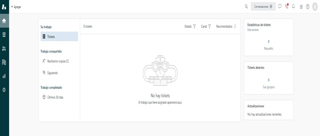
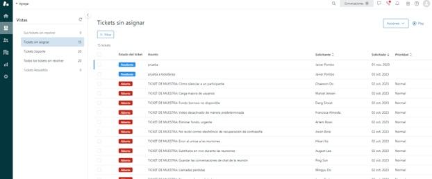
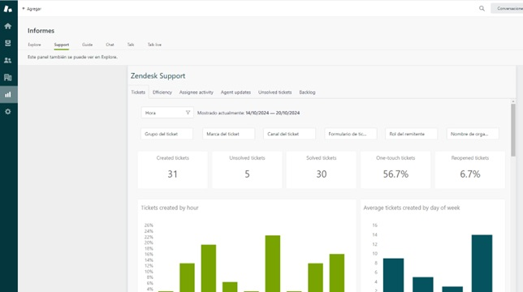

# Manual para agente  

## 1- Introducción  
- **Objetivo del Manual:** Explicar el propósito de la ticketera, sus funcionalidades y cómo los agentes deben interactuar con ella.  
- **Audiencia:** Este manual está dirigido a los agentes que se encargan de gestionar los tickets de soporte, resolver incidencias y dar seguimiento a las solicitudes de los usuarios.  

## Glosario de palabras  
- **Solicitante o usuario Final:** Es la persona que genero el ticket mediante un mail.  
- **Agente:** Es la persona que recibe el ticket para su resolución.  
- **Respuesta o Mensaje público:** Es la respuesta que realiza el agente sobre un ticket y que el usuario puede ver.  
- **Nota interna o privada:** Se utiliza para dejar comentarios en el ticket sin que le llegue un aviso al usuario final.  
- **Automatizaciones, disparadores:** Son reglas configuradas en el Zendesk las cuales se tienen que cumplir una accion para que se active la automatizacion.   

## 2- Roles de Usuarios  
Todos los roles están en orden jerárquico, un rol superior abarca los permisos de los roles inferiores.  
  
- **Dueño de cuenta:** Básicamente tiene acceso a todo.  
- **Administrador:**   
    -- Puede administrar toda la configuración, exceptuando facturación.  
    -- Crear grupos, agentes, gestionar todos los tickets.  
    -- Crear y modificar informes, entre otras cosas.  
- **Agentes:**   
    -- La función principal de los agentes es interactuar con los clientes y resolver solicitudes de soporte.  
    -- Solo pueden tratar los tickets que fueron asignados a grupos a los cuales pertenecen.  
    -- No pueden editar a otros agentes o administradores.  
- **Agentes Light y colaboradores:**  
    -- No pueden ser asignados a los tickets, pero pueden ser puestos como seguidores (reciben las actualizaciones de los tickets para mantenerlos al tanto).  
    -- No pueden cambiar el estado de un ticket.  
    -- No pueden realizar comentarios públicos, pero pueden dejar notas privadas.  
    -- Su principal función es ayudar a los agentes a resolver los tickets proporcionando información y sabiduría.  

## 3- Flujo de Trabajo de un Agente  
- **Creación de Tickets:** El usuario manda un mail a la dirección *ticketera@latinsecurities.ar*, internamente tiene un reenvió configurado al mail de Zendesk *support@latinsecurities.zendesk.com* (regla realizada en la administración de Exchange de Microsoft).  
- **Asignación de Tickets:** Actualmente como solo hay un grupo “Support”, al entrar un ticket se asigna automáticamente.  
- **Resolución de Tickets:** Describir el proceso de resolución, cómo cambiar el estado de un ticket a resuelto, y cuándo contactar al usuario final para obtener más información si es necesario.  
- **Reapertura de Tickets:** Explicar que, si un usuario no está satisfecho con la resolución, puede reabrir el ticket respondiendo al correo.  
- **Cierre de Tickets:** Detallar el proceso de cierre automático de los tickets después de 4 días sin actividad.  

## 4- Automatizaciones Configuradas  
### Aviso al usuario vía correo:  
- **Creación del ticket:** Automáticamente luego de que se crea el ticket, le avisara al usuario confirmando la creación junto al ID de ticket correspondiente.  
- **Cambio de estado o respuesta del agente:** Cuando se cambie el estado o el agente responda el ticket. Se comunicará al usuario sobre la actualización.  
### Aviso al agente vía correo:  
- **Asignación de grupo:** Cuando se genera el ticket, automáticamente, se asigna al grupo de *“Soporte”* avisando a todos los integrantes de este.  
- **Comentario del usuario:** Cuando haya una respuesta en el ticket se le avisara al agente sobre esto.  
  
**Cambio a estado Abierto:** Si el ticket figura como *“Nuevo”* luego de 1 hora pasara automáticamente al estado *“Abierto”*.  
**Cierre Automático de Tickets:** Luego de 4 días sin que se actualice un ticket en estado *“Resuelto”* se cambiara automáticamente al estado *“Cerrado”*.  

## 5- Interfaz de Zendesk  
**Pantalla de Inicio:** Aparecen los tickets asignados al agente actual (agente logeado) . 

*Vistas*:  

## 6- Reportes y Métricas  
**Informes --> Support:** Se encuentran varias métricas que muestran distintos tipos de información.  

## 7- Exportación de tickets  
Para descargar los tickets en un archivo .CSV se pueden parar en la vista que contenga los tickets que quieran descargar y van a Acciones  Exportar como CSV.

*Ejemplo:*  

