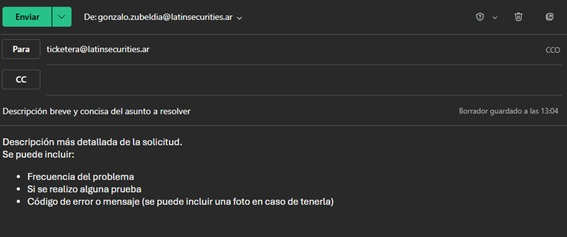

# Utilizacion ticketera para Usuario Final

## 1- Introduccion  
### ¿Qué es la ticketera?  
La ticketera es un sistema que te permite reportar problemas o solicitudes relacionadas con el área de sistemas (IT). Todo se gestiona mediante correo electrónico, facilitando el seguimiento y resolución de tus pedidos.  
  
### 2- Cómo generar un ticket  
**Paso 1: Envía un correo electrónico**  
Para generar un ticket, simplemente envía un correo electrónico a la dirección *ticketera@latinsecurities.ar.*  

El asunto del correo será el título de tu solicitud y en el cuerpo del mensaje deberás describir el problema o pedido de manera clara y detallada. Si lo crees necesario puedes agregar fotos del error o problema.  
*Ejemplo de correo:*  
  

**Paso 2: Confirmación del ticket generado**  
Una vez que envíes el correo, recibirás una confirmación automática en tu casilla de correo informándote que tu ticket ha sido creado correctamente. Este correo incluirá un número de ticket, que te permitirá hacer seguimiento del estado de tu solicitud.  

### 3- Seguimiento del ticket  
**Actualizaciones automáticas**  
Cada vez que se actualice el estado de tu ticket, recibirás un correo electrónico informándote de los cambios. Las actualizaciones pueden incluir consultas por parte de los agentes para obtener más información, o notificaciones sobre el progreso de tu solicitud.  

### 4- Responder actualizaciones  
**Cómo proporcionar más información**  
Si recibes un correo solicitando más detalles sobre tu pedido, simplemente responde al correo con la información adicional.  
Esto ayudará a los agentes a resolver el ticket de manera más eficiente.  

### 5- Resolución del ticket  
**Notificación de ticket resuelto**  
Cuando los agentes hayan resuelto tu solicitud, recibirás un correo indicando que el ticket ha sido marcado como Resuelto. Si consideras que el problema no ha sido completamente solucionado, puedes responder al correo para reabrir el ticket y continuar con el seguimiento.  

**Reabrir un ticket**  
Responde al correo de resolución si crees que tu problema no ha sido resuelto satisfactoriamente. Esto reabrirá el ticket, permitiendo a los agentes revisarlo nuevamente.  

**Ticket Cerrado**  
Si no respondes al correo de resolución en un plazo de 4 días, el ticket se cerrará automáticamente y recibirás un correo notificando que el ticket ha sido Cerrado. Una vez cerrado, el ticket ya no podrá ser reabierto, por lo que es importante que respondas antes si consideras que aún persiste el problema.  

### 6- Consejos para un mejor uso  
**Proporciona detalles claros**  
Al enviar un correo con tu solicitud, intenta ser lo más específico posible. Incluye detalles como qué error estás experimentando, cuándo ocurrió o qué pasos intentaste para resolverlo por ti mismo. Esto ayudará a que los agentes puedan entender y resolver el problema más rápido.  

**No respondas correos de ticket resuelto si estás conforme**  
Si el problema ha sido resuelto, no es necesario responder el correo de resolución. Al hacerlo, generará la reapertura del mismo.  

### 7- Preguntas Frecuentes (FAQ)  
**¿Qué pasa si no recibo confirmación de mi ticket?**  
Si no recibes un correo confirmando que tu ticket ha sido generado, revisa tu carpeta de spam o contacta al equipo de soporte.  

**¿Puedo crear más de un ticket al mismo tiempo?**  
Sí, puedes enviar diferentes solicitudes por separado a través de distintos correos.  

**¿Qué hago si me surge un problema similar o relacionado a un ticket ya generado?**  
- *En caso de que el ticket se encuentre abierto:* puedes enviar los detalles del problema como respuesta.  
- *En caso de que el ticket se encuentre Resuelto:* Deberás enviar un correo nuevo al mail indicado anteriormente para generar un nuevo ticket para que los agentes lo puedan revisar.  

